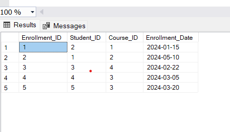
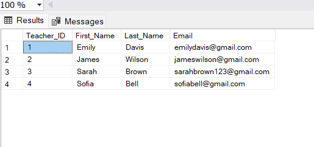
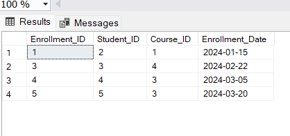
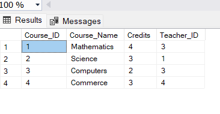
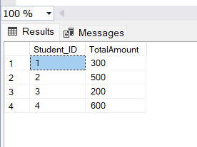
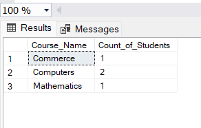
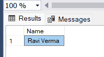
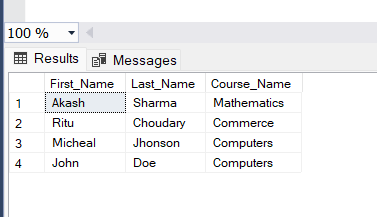
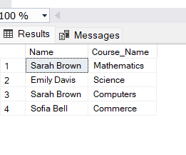
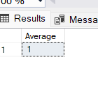

#### QUESTION 1
Write an SQL query to insert a new student named John Doe into the "Students" table.
```sql
Insert into Students Values
(5,'John','Doe','2002-07-20','johndoe@gmail.com','9876543210')
```


#### QUESTION 2
Write an SQL query to enroll an existing student in a course, specifying the enrollment date.
```sql
Insert into Enrollments Values
(5,5,3,'2024-03-20')
```


#### QUESTION 3
Update the email address of a teacher in the "Teachers" table.
```sql
Update Teachers 
Set Email='sarahbrown123@gmail.com' 
Where Teacher_ID=3;
```


#### QUESTION 4
Write an SQL query to delete a specific enrollment record, choosing based on the student and course.
```sql
Delete From Enrollments
Where Student_ID=1 AND Course_ID=2;
```


#### QUESTION 5
Update a course to assign a specific teacher using the "Courses" table.
```sql
Update Courses
Set Teacher_ID=3 
where Course_ID = 1;
```


#### QUESTION 6
Write an SQL query to calculate the total payments made by a specific student.
```sql
Select Student_ID , sum(Amount) as TotalAmount
From Payments
Group By Student_ID;
```


#### QUESTION 7
Retrieve a list of courses along with the count of students enrolled in each.
```sql
Select c.Course_Name , Count(e.Student_ID) as Count_of_Students
From Courses c Inner Join Enrollments e
On c.Course_ID=e.Course_ID
group by c.Course_Name
```


#### QUESTION 8
Find the names of students who have not enrolled in any course.
```sql
Select (First_Name +' '+Last_Name) As Name
From Students s FULL join Enrollments e
 ON s.Student_ID=e.Student_ID
 Where Enrollment_ID IS NULL
 ```
 

 #### QUESTION 9
  Retrieve the first name and last name of students, along with the names of the courses they are enrolled in.
  ```sql
Select First_Name,Last_Name, c.Course_Name
From Students s 
Join Enrollments e On s.Student_Id=e.Student_ID
Join Courses c On e.Course_ID = c.Course_ID
```


#### QUESTION 10
List names of teachers and the courses they are assigned to.
```sql
Select (First_Name +' '+Last_Name) As Name , Course_Name
From Teachers t Inner Join Courses c
On t.Teacher_ID=c.Teacher_ID; 
```


#### QUESTION 11
Calculate the average number of students enrolled in each course using aggregate functions and subqueries.
```sql
Select Course_Name, (Select Avg(num_Students) 
 From 
 (Select Count(Student_ID) as num_Students
 From Enrollments e
 Where e.Course_ID=c.Course_ID
 Group By e.Course_ID) As Course_Counts
 ) As Average_of_Students
 From Courses c;
 ```
 
 