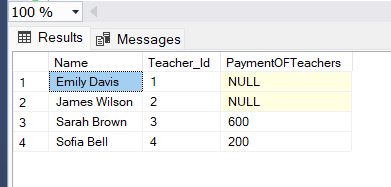

#### QUESTION 1
Write an SQL query to insert a new student named John Doe into the "Students" table.
```sql
Insert into Students Values
(5,'John','Doe','2002-07-20','johndoe@gmail.com','9876543210')
```


#### QUESTION 2
Write an SQL query to enroll an existing student in a course, specifying the enrollment date.
```sql
Insert into Enrollments Values
(5,5,3,'2024-03-20')
```


#### QUESTION 3
Update the email address of a teacher in the "Teachers" table.
```sql
Update Teachers 
Set Email='sarahbrown123@gmail.com' 
Where Teacher_ID=3;
```


#### QUESTION 4
Write an SQL query to delete a specific enrollment record, choosing based on the student and course.
```sql
Delete From Enrollments
Where Student_ID=1 AND Course_ID=2;
```


#### QUESTION 5
Update a course to assign a specific teacher using the "Courses" table.
```sql
Update Courses
Set Teacher_ID=3 
where Course_ID = 1;
```


#### QUESTION 6
Write an SQL query to calculate the total payments made by a specific student.
```sql
Select Student_ID , sum(Amount) as TotalAmount
From Payments
Group By Student_ID;
```


#### QUESTION 7
Retrieve a list of courses along with the count of students enrolled in each.
```sql
Select c.Course_Name , Count(e.Student_ID) as Count_of_Students
From Courses c Inner Join Enrollments e
On c.Course_ID=e.Course_ID
group by c.Course_Name
```


#### QUESTION 8
Find the names of students who have not enrolled in any course.
```sql
Select (First_Name +' '+Last_Name) As Name
From Students s FULL join Enrollments e
 ON s.Student_ID=e.Student_ID
 Where Enrollment_ID IS NULL
 ```
 

 #### QUESTION 9
  Retrieve the first name and last name of students, along with the names of the courses they are enrolled in.
  ```sql
Select First_Name,Last_Name, c.Course_Name
From Students s 
Join Enrollments e On s.Student_Id=e.Student_ID
Join Courses c On e.Course_ID = c.Course_ID
```


#### QUESTION 10
List names of teachers and the courses they are assigned to.
```sql
Select (First_Name +' '+Last_Name) As Name , Course_Name
From Teachers t Inner Join Courses c
On t.Teacher_ID=c.Teacher_ID; 
```


#### QUESTION 11
Calculate the average number of students enrolled in each course using aggregate functions and subqueries.
```sql
Select Avg(Total_Count) As Average  From (
Select Count(Course_Id) As Total_Count, Course_ID
From Enrollments 
Group BY Course_ID) 
As AverageOfCOurses;
 ```


 #### QUESTION 12
 Identify the student(s) who made the highest payment using a subquery.
 ```sql

 Select (s.First_Name+' '+s.Last_Name) as Student_Name 
 From Students s
 Where s.Student_Id=(Select Student_ID From Payments 
                     Where Amount = ( Select Max(AMount) 
					                   From Payments))

```


#### QUESTION 13
Retrieve a list of courses with the highest number of enrollments using subqueries.
```sql
Select Course_Name,Course_Id 
From Courses 
Where Course_ID = (
 Select Course_Id from Enrollments Group By Course_ID Having Count(Student_ID) = (
Select Max(Count_of_Enrollments)As Highest
 From (
Select Course_ID , Count(Course_ID) As Count_of_Enrollments
From Enrollments
Group By Course_ID
) As Maximum))
```


#### QUESTION 14
Calculate the total payments made to courses taught by each teacher using subqueries.

```sql
Select (t.First_Name+' '+t.Last_Name)As Name,t.Teacher_Id , 
(Select sum(Amount) From Payments p Where p.Student_ID
In (
Select  e.Student_ID 
From Enrollments e
Where e.Course_ID In (Select Course_ID From Courses c where c.Teacher_ID=t.Teacher_ID)
)) As PaymentOFTeachers
From Teachers t;
```


#### QUESTION 15
Identify students who are enrolled in more than one course.
```sql
Select Student_ID 
From Enrollments
Group By Student_ID
Having COUNT(Student_Id) >1
```

